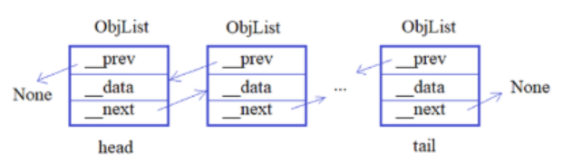
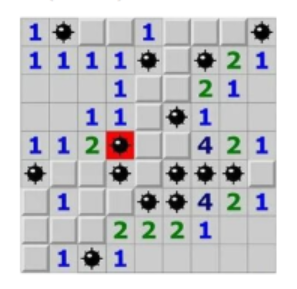
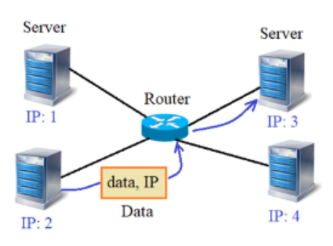

# Реализовать свой двусвязный список



## Класс `LinkedList`

**Объявите класс `LinkedList`, который будет представлять связный список в целом и иметь набор следующих методов:**

- `add_obj(self, obj)` - добавление нового объекта `obj` класса `ObjList` в конец связного списка;
- `remove_obj(self)` - удаление последнего объекта из связного списка;
- `get_data(self` - получение списка из строк локального свойства `__data` всех объектов связного списка.

**В каждом объекте этого класса должны создаваться локальные публичные атрибуты:**

- `head` - ссылка на первый объект связного списка (если список пустой, то `head == None`)
- `tail` - ссылка на последний объект связного списка
(если список пустой, то `tail == None`)

## Класс `ObjectList`

**Объекты класса `ObjectList`  должны иметь следующий набор приватных локальных свойств:**

- `__next` - ссылка на следующий объект связного списка
(если следующего объекта нет, то `__next == None`);
- `__prev` - ссылка на предыдущий объект связного списка
(если предыдущего объекта нет, то `__prev == None`);
- `__data` - строка с данными.

**Также в классе `ObjList` должны быть реализованы следующие сеттеры и геттеры:**

- `set_next(self, obj)` - изменение приватного свойства `__next` на значение `obj`;
- `set_prev(self, obj)` - изменение приватного свойства `__prev` на значение `obj`;
- `get_next(self)` - получение значения приватного свойства `__next`;
- `get_prev(self)` - получение значения приватного свойства `__prev`;
- `set_data(self, data)` - изменение приватного свойства `__data` на значение `data`;
- `get_data(self)` - получение значения приватного свойства `__data`.

## Примеры

Создавать объекты класса `ObjList` предполагается командой:

```python
ob = ObjList("данные 1")
```

А использовать класс `LinkedList` следующим образом (пример, эти строчки писать в программе не нужно):

```python
lst = LinkedList()

lst.add_obj(ObjList("данные 1"))
lst.add_obj(ObjList("данные 2"))
lst.add_obj(ObjList("данные 3"))

res = lst.get_data()  # ['данные 1', 'данные 2', 'данные 3']
```

## Итог

Объявите в программе классы `LinkedList` и `ObjList` в соответствии с заданием.

**P.S.**

На экран ничего выводить не нужно

# Реализовать игру “Сапер”

В консоли, с помощью двух классов `Cell` и `GameBoard`

- `Cell` - для представления клетки игрового поля;
- `GameBoard` - для управления игровым полем, размером **N x N** клеток.

## Класс `Cell`

**С помощью класса `Cell` предполагается создавать отдельные клетки командой:**

```python
c1 = Cell(around_mines, mine)
```

Здесь `around_mines` - число мин вокруг данной клетки поля; `mine` - булева величина (True / False), означающая наличие мины в текущей клетке. При этом, в каждом объекте класса `Cell` должны создаваться локальные свойства:

- `around_mines` - число мин вокруг клетки (начальное значение 0);
- `mine` - наличие / отсутствие мины в текущей клетке (True / False);
- `fl_open` - открыта / закрыта клетка - булево значение (True / False). Изначально все клетки закрыты (False).



## Класс `GameBoard`

**С помощью класса `GameBoard` должна быть возможность создвать квадратное игровое поле с числом клеток N x N:**

```python
board_game = GameBoard(N, M)
```

Здесь `N` - размер поля, `M` - общее число мин на поле. При этом, каждая клетка представляется объектом класса `Cell` и все объекты хранятся в двумерном списке **N x N** элементов - локальном свойстве `board` объекта класса `GameBoard`.

**В классе `GameBoard` должны быть также реализованы следующие методы:**

- `__init__()` - инициализация поля с новой расстановкой `M` мин (случайным образом по игровому полю, разумеется каждая мина должна находиться в отдельной клетке);
- `show()` - отображение поля в консоли в виде таблицы чисел открытых клеток
    - если клетка не открыта, то отображается символ `#` ;
    - мина отображается символом `*`;
    - между клетками при отображении ставить пробел.

При создании экземпляра класса `GameBoard` в его инициализаторе следует вызывать метод `__init__()` для первоначальной инициализации игрового поля.

В классе `GameBoard` могут быть и другие вспомогательные методы.

## Итог

Создайте экземпляр `board_game` класса `GamePole` с размером поля N = 10 и числом мин M = 12.

**P.S.**

На экран ничего выводить не нужно

# Реализовать имитацию локальной сети

Состоит из набора серверов, соединенных между собой через роутер



Каждый сервер может отправлять пакет любому другому серверу сети. Для этого у каждого есть свой уникальный IP-адрес. Для простоты - это простое целое (натуральное) число от 1 до N, где N - общее число серверов.

Алгоритм следующий:
Предположим, сервер с IP = 2 собирается отправить пакет информации серверу с IP = 3. Для этого, он сначала отправляет пакет роутеру, а уже тот смотрит на IP-адрес и пересылает пакет нужному узлу (серверу).

Для реализации этой схемы программе предлагается объявить три класса:

- `Server` - для описания работы серверов в сети;
- `Router` - для описания работы роутеров в сети
(в данной задаче полагается один роутер);
- `Data` - для описания пакета информации.

Серверы будут создаваться командой:

```python
sv = Server()
```

При этом, уникальный IP-адрес каждого сервера должен формироваться автоматически при создании нового экземпляра класса `Server`.

Далее, роутер должен создаваться аналогичной командой:

```python
router = Router()
```

А пакеты данных командой:

```python
data = Data(
    data: str,  # строка с данными
    ip: int,  # IP-адрес назначения
)
```

## Класс `Router`

Для формирования и функционирования локальной сети, в классе `Router` должны быть реализованы следующие методы:

- `link(server)` - для присоедниения сервера `server` (объекта класса `Server`) к роутеру (для простоты, каждый сервер соединен только с одним роутером);
- `unlink(server)` - для отсоединения сервера `server` (объекта класса `Server`) от роутера;
- `send_data()` - для отправки всех пакетов (объектов класса `Data`) из буфера роутера соответствующим серверам (после отправки буфер должен очищаться);

И одно обязательное локальное свойство (могут быть и другие свойства):

- `buffer` - список для хранения принятых от серверов пакетов (объектов класса `Data`)

## Класс `Server`

Класс `Server` должен содержать свой набор методов:

- `send_data(data)` - для отправки информационного пакета `data` (объекта класса `Data`) с указанным IP-адресом получателя (пакет отправляется роутеру и сохраняется в его буфере - локальном свойстве `buffer`);
- `get_data()` - возвращает список принятых пакетов (если ничего принято не было, то возвращается пустой список) и очищает входной буфер;
- `get_ip()` - возвращает свой IP-адрес.

Соответственно, в объектах класса `Server` должны быть локальные свойства:

- `buffer` - список принятых пакетов (объекты класса `Data`, изначально пустой);
- `ip` - IP-адрес текущего сервера.

## Класс `Data`

Наконец, объекты класса `Data` должны содержать два следующих локальных свойства:

- `data` - передаваемые данные (строка);
- `ip` - IP-адрес назначения.

Пример использования эих классов (эти строчки в программе писать не нужно):

```python
router = Router()
sv_from = Server()
sv_from2 = Server()

router.link(sv_from)
router.link(sv_from2)
router.link(Server())
router.link(Server())

sv_to = Server()
router.link(sv_to)

sv_from.send_data(Data("Hello", sv_to.get_ip()))
sv_from2.send_data(Data("Hello", sv_to.get_ip()))
sv_to.send_data(Data("Hi", sv_from.get_ip()))

router.send_data()

msg_lst_from = sv_from.get_data()
msg_lst_to = sv_to.get_data()
```

Ваша задача реализовать классы `Router`, `Server` и `Data` в соответствии с приведенным техническим заданием (ТЗ). Что-либо выводить на экран не нужно.
